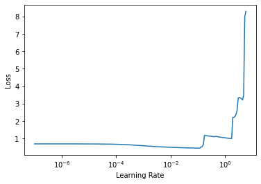

# Bayesian optimization for neural architecture search

In this blog I will be using bayes_opt, a general purpose bayesian optimization framework to optimize hyperparameters of a fastai tabular learner with categorical embedding layers. I will do my best to account for the evaluation metric along the way. The links to the notebooks which this is based on, including Jeremy Howard's lecture, Zachary Mueller's repo and the bayes_opt repo as well as some other resources are provided at the end.

Note that the dataset I am using for this blog is the kaggle tabular playground march-2021 dataset which could be downloaded at https://www.kaggle.com/c/tabular-playground-series-mar-2021
Also note that I am not going to go over the EDA aspects of the problem because the purpose is to show neural architecture search using bayesian optimization as it applies to structured data.


```python
##Import the required packages. These include pandas, numpy,scikit-learn and optuna
!pip install bayesian-optimization -q
from bayes_opt import BayesianOptimization
from fastai.tabular.all import *
import numpy as np # linear algebra
import pandas as pd # data processing, CSV file I/O (e.g. pd.read_csv)
import fastai


import os
for dirname, _, filenames in os.walk('/kaggle/input'):
    for filename in filenames:
        print(os.path.join(dirname, filename))
```

    /kaggle/input/tabular-playground-series-mar-2021/sample_submission.csv
    /kaggle/input/tabular-playground-series-mar-2021/train.csv
    /kaggle/input/tabular-playground-series-mar-2021/test.csv


I read the train set, test set to be loaded to the python runtime.


```python
train_ = pd.read_csv('train.csv')
test_ = pd.read_csv('test.csv')
```


```python
train_.shape
```


    (300000, 32)


Inspecting class imbalance. I will use stratfied sampling in train test split in a subsequent split to ensure this class imbalance is equally represented in the train and validation data sets.


```python
from collections import Counter
Counter(train_['target'])
```


    Counter({0: 220539, 1: 79461})


As a general rule of thumb, for exploratory work, I like to keep the mini batch size to around 1% of my training set size. Also ensure that you typecast the batch size to an integer, otherwise fastai will throw an error.


```python
bs = int(train_.shape[0]*0.8/100)
bs
```


    2400


Inspect the columns of the training data set 


```python
train_.columns
```


    Index(['id', 'cat0', 'cat1', 'cat2', 'cat3', 'cat4', 'cat5', 'cat6', 'cat7',
           'cat8', 'cat9', 'cat10', 'cat11', 'cat12', 'cat13', 'cat14', 'cat15',
           'cat16', 'cat17', 'cat18', 'cont0', 'cont1', 'cont2', 'cont3', 'cont4',
           'cont5', 'cont6', 'cont7', 'cont8', 'cont9', 'cont10', 'target'],
          dtype='object')


Get the feature+target columns of the training set and assign it to a different variable


```python
df = train_[['cat0', 'cat1', 'cat2', 'cat3', 'cat4', 'cat5', 'cat6', 'cat7', 'cat8', 'cat9', 'cat10', 'cat11', 'cat12', 'cat13', 'cat14', 'cat15', 'cat16', 'cat17', 'cat18', 'cont0', 'cont1', 'cont2', 'cont3', 'cont4', 'cont5', 'cont6', 'cont7', 'cont8', 'cont9', 'cont10', 'target']]
```

Define a fit function that the Bayesian optimization framework will optimize. The hyperparameters we are optimizing for in this manner are the number of layers, the number of neurons per each such layer, learning rate, drop out and weight decay

Also I couldn't stress enough how important it is to pick the right metric to optimize. Since the competition guidelines specifically ask for auc and this is a binary target, RocAucBinary() is the approproate metric compatible with fastai here. Optimizing for accuracy might not lead to the best score in the confines of this tabular playground exercise.


```python
def fit_with(lr:float, wd:float, dp:float, n_layers:float, layer_1:float, layer_2:float, layer_3:float):

  print(lr, wd, dp)
  if int(n_layers) == 2:
    layers = [int(layer_1), int(layer_2)]
  elif int(n_layers) == 3:
    layers = [int(layer_1), int(layer_2), int(layer_3)]
  else:
    layers = [int(layer_1)]
  config = tabular_config(embed_p=float(dp),
                          ps=float(wd))
  learn = tabular_learner(dls, layers=layers, metrics=RocAucBinary(), config = config)

  with learn.no_bar() and learn.no_logging():
    learn.fit(5, lr=float(lr))

  auc = float(learn.validate()[1])

  return auc
```

Assign lists of categorical variables and continuous variables to separate variables, specify preprocessing procs, the target and the correct type of data block for the target.

Notice that I do the train test split stratified on the target column


```python
cat_names = ['cat0', 'cat1', 'cat2', 'cat3', 'cat4', 'cat5', 'cat6', 'cat7', 'cat8', 'cat9', 'cat10', 'cat11', 'cat12', 'cat13', 'cat14', 'cat15', 'cat16', 'cat17', 'cat18']
cont_names = ['cont0', 'cont1', 'cont2', 'cont3', 'cont4', 'cont5', 'cont6', 'cont7', 'cont8', 'cont9', 'cont10']
procs = [Categorify, FillMissing, Normalize]
y_names = 'target'
y_block = CategoryBlock()
splits = TrainTestSplitter(test_size=0.2, random_state=42, stratify=df['target'])(range_of(df))
```


```python
to = TabularPandas(df, procs=procs, cat_names=cat_names, cont_names=cont_names,
                   y_names=y_names, y_block=y_block, splits=splits)
```


```python
dls = to.dataloaders(bs=bs)

```

Specify ranges for each of the hyperparameters discussed above. This is pretty much directly taken from Zachary Mueller's notebook. Feel free to play around with this but it's a good place to start.


```python
hps = {'lr': (1e-05, 1e-01),
      'wd': (4e-4, 0.4),
      'dp': (0.01, 0.5),
       'n_layers': (1,3),
       'layer_1': (50, 200),
       'layer_2': (100, 1000),
       'layer_3': (200, 2000)}
```

Set up the optimizer and run the search. Note that we intend to maximize the auc so we seek for the maximum solution for 10 iterations


```python
optim = BayesianOptimization(
    f = fit_with, # fit function as defined above
    pbounds = hps, # our hyper parameters 
    verbose = 3, 
    random_state=42
)
%time optim.maximize(n_iter=10) #Run the optimizer for 10 iterations
```

    |   iter    |  target   |    dp     |  layer_1  |  layer_2  |  layer_3  |    lr     | n_layers  |    wd     |
    -------------------------------------------------------------------------------------------------------------
    0.01561030385783923 0.023610211422412507 0.19352465823520762


    |  1        |  0.8876   |  0.1935   |  192.6    |  758.8    |  1.278e+0 |  0.01561  |  1.312    |  0.02361  |
    0.09699128611767782 0.08525070862703915 0.4344263114297182


    |  2        |  0.8831   |  0.4344   |  140.2    |  737.3    |  237.1    |  0.09699  |  2.665    |  0.08525  |
    0.043200182414025165 0.24489641673106285 0.0990942339314793


    |  3        |  0.8857   |  0.09909  |  77.51    |  373.8    |  1.145e+0 |  0.0432   |  1.582    |  0.2449   |
    0.07851974437968744 0.2058880815900792 0.0783519917195005


    |  4        |  0.882    |  0.07835  |  93.82    |  429.7    |  1.021e+0 |  0.07852  |  1.399    |  0.2059   |
    0.006514508782598099 0.38626656041659396 0.3002831387424008


    |  5        |  0.885    |  0.3003   |  56.97    |  646.8    |  506.9    |  0.006515 |  2.898    |  0.3863   |
    0.0880907071028698 0.10312225179880781 0.17602350638717562


    |  6        |  0.881    |  0.176    |  192.8    |  764.1    |  1.275e+0 |  0.08809  |  1.099    |  0.1031   |
    0.07518834490613562 0.19932765454292467 0.04154169265570138


    |  7        |  0.8817   |  0.04154  |  66.35    |  906.8    |  1.73e+03 |  0.07519  |  1.558    |  0.1993   |
    0.09426328772291151 0.2722909136641639 0.21858882867861856


    |  8        |  0.8824   |  0.2186   |  101.1    |  914.4    |  1.051e+0 |  0.09426  |  1.594    |  0.2723   |
    0.07923910607866624 0.18598027201962777 0.49929258780251917


    |  9        |  0.8822   |  0.4993   |  57.67    |  804.3    |  1.536e+0 |  0.07924  |  1.699    |  0.186    |
    0.09661208267429061 0.011454215681021531 0.2824768254104184


    |  10       |  0.5      |  0.2825   |  185.6    |  695.6    |  614.9    |  0.09661  |  1.792    |  0.01145  |
    1e-05 0.0004 0.5


    |  11       |  0.8744   |  0.5      |  139.0    |  677.4    |  1.391e+0 |  1e-05    |  3.0      |  0.0004   |
    1e-05 0.0004 0.38143709535750236


    |  12       |  0.8729   |  0.3814   |  174.9    |  612.9    |  1.227e+0 |  1e-05    |  2.301    |  0.0004   |
    0.08619267164588613 0.246830525049531 0.3133913819652203


    |  13       |  0.8844   |  0.3134   |  68.41    |  603.5    |  357.9    |  0.08619  |  2.643    |  0.2468   |
    0.001416749885928521 0.05547000521613273 0.3364541844761861


    |  14       |  0.8883   |  0.3365   |  54.62    |  807.8    |  1.542e+0 |  0.001417 |  2.237    |  0.05547  |
    0.03641783347159078 0.2901881376570019 0.3366551346664063


    |  15       |  0.8844   |  0.3367   |  58.94    |  982.8    |  1.554e+0 |  0.03642  |  2.716    |  0.2902   |
    =============================================================================================================
    CPU times: user 3min 37s, sys: 2.84 s, total: 3min 40s
    Wall time: 3min 38s


Let's inspect the best hyperparameters as discovered by our search


```python
print(optim.max)

```

    {'target': 0.8882793724615399, 'params': {'dp': 0.3364541844761861, 'layer_1': 54.616724182929104, 'layer_2': 807.8243595262542, 'layer_3': 1541.5251729166685, 'lr': 0.001416749885928521, 'n_layers': 2.237192244004574, 'wd': 0.05547000521613273}}


For the sake of brevity I only ran this for 10 iterations on the Kaggle environment. I ran this in a gpu enabled Colab pro instance for 500 iterations and the best I managed to get was as follows.


```python
params = {'target': 0.8899, 'params': {'dp': 0.118, 'layer_1': 172.7, 'layer_2': 198.3, 'layer_3': 1.934e+0, 'lr': 0.001991 , 'n_layers': 2.116, 'wd': 0.08398}}
params
```


    {'target': 0.8899,
     'params': {'dp': 0.118,
      'layer_1': 172.7,
      'layer_2': 198.3,
      'layer_3': 1.934,
      'lr': 0.001991,
      'n_layers': 2.116,
      'wd': 0.08398}}


It's impossible to have bits and pieces/ fractional neuron numbers in an MLP. So this requires some interpretation. A cleaned up set of hyperparameters on my 500 iteration search is as follows


```python
params = {'target': 0.8899,
 'params': {'dp': 0.118,
  'layer_1': 172,
  'layer_2': 198,
  'lr': 0.001991,
  'n_layers': 2,
  'wd': 0.08398}}
```

Let's train a tabular learner with these hyperparameters for a few cycles using fit one cycle using the discovered learning rate


```python
config = tabular_config(embed_p=float(0.118),
                          ps=float(0.08398))
layers = [172,198]
dls = to.dataloaders(bs=bs)
learn = tabular_learner(dls, layers=layers, metrics=RocAucBinary(), config = config)

```

Let's see if the learning rate finder's estimation for the learning rate matches what we found using the bayesian hyperparameter search


```python
learn.lr_find(stop_div=False, num_it=200)

```


    SuggestedLRs(lr_min=0.010000000149011612, lr_steep=3.6307804584503174)





They don't particularly agree. However, in this case I will go with what we found in the hyperparamter search. I prefer not to risk going with too large a learning rate as it could risk overstepping global minima and bouncing around in the parameter space.


```python
learn.fit_one_cycle(10,  0.001991)

```


<table border="1" class="dataframe">
  <thead>
    <tr style="text-align: left;">
      <th>epoch</th>
      <th>train_loss</th>
      <th>valid_loss</th>
      <th>roc_auc_score</th>
      <th>time</th>
    </tr>
  </thead>
  <tbody>
    <tr>
      <td>0</td>
      <td>0.406316</td>
      <td>0.358901</td>
      <td>0.885283</td>
      <td>00:03</td>
    </tr>
    <tr>
      <td>1</td>
      <td>0.365541</td>
      <td>0.356479</td>
      <td>0.886565</td>
      <td>00:02</td>
    </tr>
    <tr>
      <td>2</td>
      <td>0.358712</td>
      <td>0.353471</td>
      <td>0.887835</td>
      <td>00:02</td>
    </tr>
    <tr>
      <td>3</td>
      <td>0.354123</td>
      <td>0.352486</td>
      <td>0.888256</td>
      <td>00:02</td>
    </tr>
    <tr>
      <td>4</td>
      <td>0.351733</td>
      <td>0.352626</td>
      <td>0.889422</td>
      <td>00:03</td>
    </tr>
    <tr>
      <td>5</td>
      <td>0.349477</td>
      <td>0.351152</td>
      <td>0.889622</td>
      <td>00:02</td>
    </tr>
    <tr>
      <td>6</td>
      <td>0.346552</td>
      <td>0.350374</td>
      <td>0.889890</td>
      <td>00:02</td>
    </tr>
    <tr>
      <td>7</td>
      <td>0.342852</td>
      <td>0.349759</td>
      <td>0.890426</td>
      <td>00:02</td>
    </tr>
    <tr>
      <td>8</td>
      <td>0.340346</td>
      <td>0.349482</td>
      <td>0.890526</td>
      <td>00:03</td>
    </tr>
    <tr>
      <td>9</td>
      <td>0.339591</td>
      <td>0.349477</td>
      <td>0.890571</td>
      <td>00:03</td>
    </tr>
  </tbody>
</table>


Get the list of ids from the test set and subset the test_ dataframe for prediction with the trained tabular learner


```python
test_df = test_[['cat0', 'cat1', 'cat2', 'cat3', 'cat4', 'cat5', 'cat6', 'cat7', 'cat8', 'cat9', 'cat10', 'cat11', 'cat12', 'cat13', 'cat14', 'cat15', 'cat16', 'cat17', 'cat18', 'cont0', 'cont1', 'cont2', 'cont3', 'cont4', 'cont5', 'cont6', 'cont7', 'cont8', 'cont9', 'cont10']]
```


```python
ids = test_.id.to_list()
```


```python
dl = learn.dls.test_dl(test_df)
results = learn.get_preds(dl=dl)
```


```python
predictions = []
for i in range(200000):
    predictions.append(int(np.argmax(results[0][i])))

    
    
```

Create the submission data set 


```python
resultf = pd.DataFrame()
resultf['id'] = ids
resultf['target'] = predictions
resultf.to_csv('submission.csv', index=False)
```


```python
resultf
```


<div>
<style scoped>
    .dataframe tbody tr th:only-of-type {
        vertical-align: middle;
    }

    .dataframe tbody tr th {
        vertical-align: top;
    }

    .dataframe thead th {
        text-align: right;
    }
</style>
<table border="1" class="dataframe">
  <thead>
    <tr style="text-align: right;">
      <th></th>
      <th>id</th>
      <th>target</th>
    </tr>
  </thead>
  <tbody>
    <tr>
      <th>0</th>
      <td>5</td>
      <td>0</td>
    </tr>
    <tr>
      <th>1</th>
      <td>6</td>
      <td>0</td>
    </tr>
    <tr>
      <th>2</th>
      <td>8</td>
      <td>0</td>
    </tr>
    <tr>
      <th>3</th>
      <td>9</td>
      <td>0</td>
    </tr>
    <tr>
      <th>4</th>
      <td>11</td>
      <td>0</td>
    </tr>
    <tr>
      <th>...</th>
      <td>...</td>
      <td>...</td>
    </tr>
    <tr>
      <th>199995</th>
      <td>499983</td>
      <td>1</td>
    </tr>
    <tr>
      <th>199996</th>
      <td>499984</td>
      <td>0</td>
    </tr>
    <tr>
      <th>199997</th>
      <td>499987</td>
      <td>1</td>
    </tr>
    <tr>
      <th>199998</th>
      <td>499994</td>
      <td>0</td>
    </tr>
    <tr>
      <th>199999</th>
      <td>499998</td>
      <td>1</td>
    </tr>
  </tbody>
</table>
<p>200000 rows × 2 columns</p>
</div>


Some useful links:
Zachary Mueller's code:
https://github.com/muellerzr/Practical-Deep-Learning-for-Coders-2.0/blob/master/Tabular%20Notebooks/02_Bayesian_Optimization.ipynb

Jeremy Howard's lesson:
https://course.fast.ai/videos/?lesson=7

Bayesian optimization framework used in this example:
https://github.com/fmfn/BayesianOptimization[](http://)

